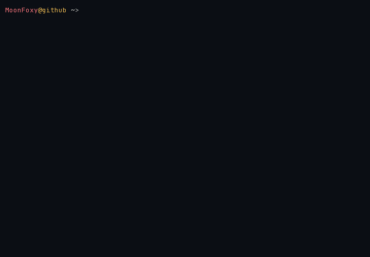

  <a href="./README.md">🗺️ English</a> · <strong>🇷🇺 Русский</strong>

  <picture>
    <source media="(prefers-color-scheme: dark)" srcset=".github/assets/neofetch-ru-dark.gif">
    <source media="(prefers-color-scheme: light)" srcset=".github/assets/neofetch-ru-light.gif">
    
  </picture>

  Привет, я Илья — <code>MoonFoxy</code>.

  Android-разработчик · Kotlin · Jetpack Compose

---

### `$ languages --history`

<!-- STACK:LANGUAGES:START -->

  
  
  
  

Обновляется раз в неделю. Языки ниже 2% скрываются.
<!-- STACK:LANGUAGES:END -->

### `$ toolbox --native-android`

<!-- STACK:TOOLS:START -->

  
  
  
  
  
  
  
  
  
  
  
  

<!-- STACK:TOOLS:END -->

### `$ contact`

  
  
  
  

  

