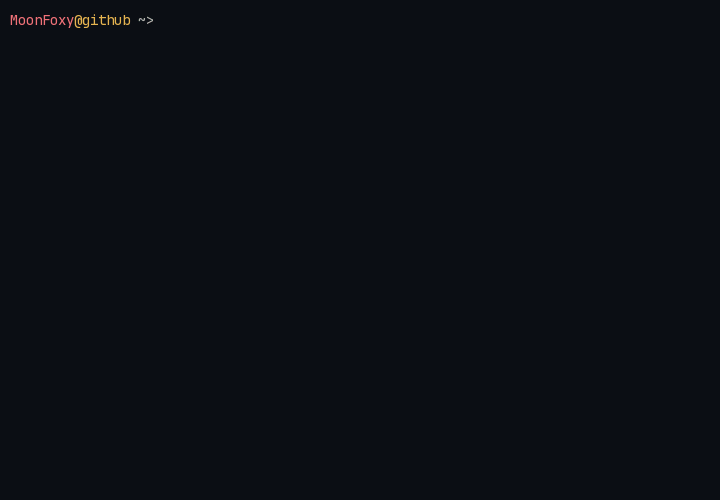

  <strong>🗺️ English</strong> · <a href="./README-ru.md">🇷🇺 Русский</a>

  <picture>
    <source media="(prefers-color-scheme: dark)" srcset=".github/assets/neofetch-en-dark.gif">
    <source media="(prefers-color-scheme: light)" srcset=".github/assets/neofetch-en-light.gif">
    
  </picture>

  Hi, I'm Ilya — aka <code>MoonFoxy</code>.

  Android Developer · Kotlin · Jetpack Compose

---

### `$ languages --history`

<!-- STACK:LANGUAGES:START -->

  
  
  

Updated weekly. Languages below 2% are hidden.
<!-- STACK:LANGUAGES:END -->

### `$ toolbox --native-android`

<!-- STACK:TOOLS:START -->

  
  
  
  
  
  
  
  

<!-- STACK:TOOLS:END -->

### `$ contact`

  
  
  
  

  

